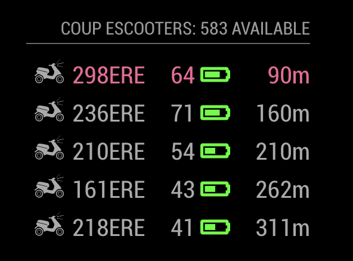

# MMM-CoupEscooters
A module for the MagicMirror to display the closest <B>Coup e-scooters</B> in Berlin and other cities

This module is an extension of the amazing [MagicMirror2](https://github.com/MichMich/MagicMirror) project by [MichMich](https://github.com/MichMich/).

## Screenshots

## Current version

v0.1

## Prerequisite
A working installation of [MagicMirror2](https://github.com/MichMich/MagicMirror)
 
## Dependencies
  * npm
  * [lodash](https://www.npmjs.com/package/lodash)  

## Installation
1. Navigate into your MagicMirror's `modules` folder.
2. Execute `git clone https://github.com/bogomips/MMM-CoupEscooters`.
3. Execute `cd MMM-CoupEscooters`.
3. Execute `npm install`.

## Module behavior

## Configuration
Sample minimum configuration entry for your `~/MagicMirror/config/config.js`:

    ...
    
    {
        module: 'MMM-CoupEscooters',
        position: 'top_right',
        config: {
            myPosition:[xxx.xxxxx, yy.yyyyy] ,  		// Your latitude and longitude, take it from google maps.            
        }
    } 							// If this isn't your last module, add a comma after the bracket
    
    ...

## Config Options
| **Option** | **Default** | **Description** |
| :---: | :---: | --- |
| cityId | fb7aadac-bded-4321-9223-e3c30c5e3ba5 |  Which city do you want to use?  <EM> Default: Berlin, Germany, I don't know yet the values for other cities</EM>
 |
| updateInterval | 120 |  How often you wanna refresh your data?  <EM> I suggest not to set a low value to avoid blocks </EM>
 |
| scootersToDisplay | 5 |  How many available scooter do you wanna display?</EM>
 |
| highlightWithin | 150 | Highlight the scooter included in this range (in meters)
| highlightColor | #f06595 |  The color to use to highlight closer scooters</EM>
|
| batteryColor | ['#ff0000','#F9D71C','#00ff00'] |  The color of the battery (red, yellow, green)</EM>
 |
